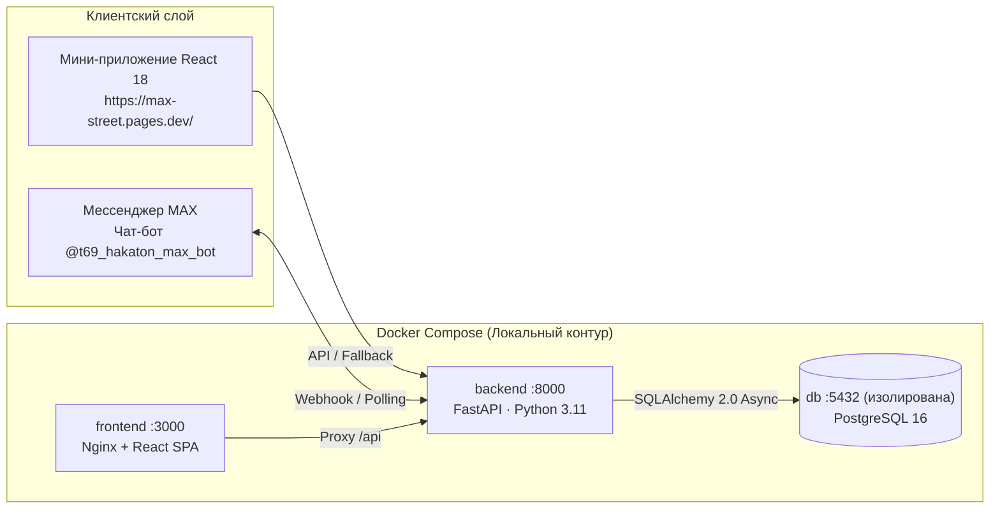

# MAX Спот 🏀⚽🎾
**Интерактивная карта, матчмейкинг дворового спорта и безопасная аренда кортов Safe Split для платформы MAX**  
*Хакатон платформы MAX · Кейс «Досуг и развлечения»*

---

### 🌐 Быстрый доступ к сервисам
- **Production Frontend (Cloudflare Pages):** [https://max-street.pages.dev/](https://max-street.pages.dev/)
- **Официальный бот MAX:** `@t69_hakaton_max_bot` (ID: `393483883`, Имя: `Хакатон МАХ 69`)
- **Локальный веб-интерфейс (после запуска):** [http://localhost:3000](http://localhost:3000)
- **REST API Swagger:** [http://localhost:8000/api/docs](http://localhost:8000/api/docs)
- **API Healthcheck:** [http://localhost:8000/api/health](http://localhost:8000/api/health)

---

## ⚡ Экспресс-проверка жюри за 60 секунд (Safe Split в 1 клик)

Решение содержит полностью преднастроенный демонстрационный сценарий, готовый к мгновенной проверке:

1. Откройте веб-приложение **[https://max-street.pages.dev/](https://max-street.pages.dev/)** (или локально `http://localhost:3000`).
2. Включите фильтр **«Аренда»** и выберите корт **«Спортивный центр «Локомотив» (Мини-футбол)»** (ул. Константина Заслонова, 23/4).
3. В открывшейся карточке уже готово лобби Safe Split со статусом **5/6 участников**:
   - Аренда зала: **3 000 ₽**, доля каждого участника: **500 ₽**.
   - Пять участников уже внесли свои доли (собрано **2 500 ₽ из 3 000 ₽**).
4. Нажмите кнопку **«Внести долю (500 ₽)»** (или быструю симуляцию):
   - Производится тестовая оплата доли 500 ₽ через Safe Split (mock-СБП).
   - Сбор средств закрывается на 100%, статус слота и лобби автоматически переходит в **«Забронировано»** (`booked`).
   - Формируется номер брони `#BOOK-LOKO-701` и электронный ваучер для входа на корт.
5. Перейдите на любую дворовую площадку (например, *Стритбол-парк на Крестовском* или *Новая Голландия*) и проверьте блок **«Народный контроль»** — отображаются зарегистрированные тикеты поломок сеток, покрытия и колец.

---

## 1. Назначение сервиса «MAX Спот»

«MAX Спот» — комплексная экосистема для популяризации любительского спорта, объединяющая:
1. **Интерактивную карту спотов Санкт-Петербурга** (баскетбол, футбол, падел, теннис, воркаут) с фильтрами, типами покрытия, освещением, рейтингом и сортировкой «Рядом» по реальной геопозиции пользователя.
2. **Матчмейкинг дворовых игр:** поиск напарников на 3×3, 5×5 или воркаут, кворум и уведомления в MAX.
3. **Safe Split (безопасный сплит-эскроу):** совместная аренда коммерческих кортов и залов. Деньги не переводятся на карту организатора, а замораживаются на эскроу-счёте лобби. Выкуп происходит автоматически только при сборе 100% суммы; в случае недобора к дедлайну средства возвращаются участникам.
4. **Real-time синхронизация (Server-Sent Events):** шина событий EventBus мгновенно транслирует взносы долей и кворум на экраны всех участников в реальном времени без поллинга.
5. **«Карма» и рейтинг надёжности игроков:** система защиты от неявок (no-show) с отображением процента надёжности участников в карточках лобби.
6. **«Народный контроль»:** краудсорсинг дефектов спортивной инфраструктуры (сломанные кольца, сетки, трещины в покрытии) с 1-клик экспортом официального заявления для порталов «Наш Санкт-Петербург» и «Госуслуги».
7. **Отказоустойчивость (Graceful Degradation):** фронтенд приложения спроектирован так, что при любых сетевых задержках или недоступности бэкенда интерфейс плавно переходит в автономный режим со встроенным набором из 15 проверенных площадок СПб и мягким уведомлением пользователя, исключая «белый экран».

---

## 2. Архитектура и состав решения



| Компонент | Стек | Роль |
|---|---|---|
| **Backend** | Python 3.11, FastAPI, SQLAlchemy 2.0 Async, asyncpg, Pydantic v2 | REST API, бизнес-логика лобби, эскроу Safe Split, watchdog дедлайнов, сидер, обработчик вебхуков бота |
| **Database** | PostgreSQL 16 (alpine) | Изолированная реляционная БД во внутренней bridge-сети Docker (порт 5432 закрыт наружу) |
| **Frontend** | React 18, Vite, TypeScript, Tailwind CSS, Leaflet, Lucide Icons | Отказоустойчивое SPA-приложение, интерактивная карта, карточки спотов, модалки Safe Split |
| **MAX Bot API** | Webhook / Long Polling (`platform-api2.max.ru`) | Команды `/start`, `/find`, `/my`, `/near`, приём геолокации, уведомления о кворуме и бронях |

---

## 3. Запуск одной командой и управление

### Требования
- Docker 24+ с Compose v2 (`docker compose`).
- Свободные порты `3000` (фронтенд) и `8000` (бэкенд).
- Порт PostgreSQL `5432` изолирован внутри docker-сети и не требует освобождения на хосте.

### Запуск (строго по регламенту)
Сборка оптимизирована и занимает **менее 1 минуты** (лимит регламента — 5 минут):

```bash
docker compose up --build -d
```
*(Также поддерживается синтаксис `docker-compose up --build -d` через файл `docker-compose.yml`)*.

### Проверка статуса контейнеров
```bash
docker compose ps
```
Все 3 сервиса (`db`, `backend`, `frontend`) должны перейти в состояние `healthy`.

### Автоматический smoke-тест (код 0)
В репозитории есть готовый скрипт сквозного тестирования API, не требующий внешних зависимостей (только Python stdlib):

```bash
python scripts/smoke_test.py
```
Скрипт проверяет `/health`, загрузку 15 площадок СПб, фильтры, создание лобби, кворум, бронирование слота Safe Split, эскроу-выписку и завершается с кодом **0**.

### Остановка
```bash
docker compose down
```
Для полного сброса базы и повторного сидирования:
```bash
docker compose down -v
```

---

## 4. Переменные окружения и используемые порты

Все конфигурационные параметры имеют безопасные значения по умолчанию и описаны в файле [`.env.example`](.env.example). **В репозитории отсутствуют любые реальные секреты, пароли и токены.**

### Используемые порты

| Порт на хосте | Сервис | Доступность | Назначение |
|---|---|---|---|
| **3000** | Frontend (Nginx) | Публичный на хосте | Веб-интерфейс мини-приложения |
| **8000** | Backend (FastAPI / Uvicorn) | Публичный на хосте | REST API, `/api/docs`, `/api/health`, `/webhook` |
| — | Database (PostgreSQL 16) | **Изолирован** (только сеть `db:5432`) | Внутренняя БД, порт 5432 наружу **не проброшен** |

### Ключевые переменные (.env)

```env
# Порты на хосте
FRONTEND_PORT=3000
BACKEND_PORT=8000

# PostgreSQL (внутренняя сеть bridge)
POSTGRES_USER=maxstreet
POSTGRES_PASSWORD=maxstreet_local
POSTGRES_DB=maxstreet

# Приложение и CORS
APP_TIMEZONE=Europe/Moscow
CORS_ORIGINS=https://max-street.pages.dev,http://localhost:3000,http://localhost:5173,http://127.0.0.1:3000,http://127.0.0.1:5173,http://localhost:8000,*
SEED_DEMO_DATA=true
SLOTS_SEED_DAYS=5

# Безопасный сплит-эскроу (mock-режим)
PAYMENT_MODE=mock
ESCROW_DEADLINE_MINUTES=120
ESCROW_WATCHDOG_INTERVAL_SECONDS=30

# MAX Bot API
MAX_BOT_TOKEN=
MAX_API_BASE_URL=https://platform-api2.max.ru
MAX_BOT_MODE=auto
MAX_WEBHOOK_URL=
MINIAPP_URL=https://max-street.pages.dev
```

---

## 5. Модельные данные и интеграции (п. 10 и 13 регламента хакатона)

Согласно пунктам 10 и 13 регламента хакатона, внешние платёжные шлюзы и закрытые системы бронирования коммерческих кортов **эмулируются локально**:

1. **Эмуляция Safe Split (эскроу и СБП):**
   - Метод оплаты: `sbp_mock`. Реальные денежные средства не списываются.
   - Каждый взнос регистрируется в таблице `escrow_transactions` с уникальным кодом транзакции и привязкой к лобби `ESC-XXXX-XXXX`.
   - При сборе 100% суммы (например, 6 из 6 по 500 ₽) срабатывает mock-провайдер бронирования (`services/mock_booking_provider.py`), слот переводится в статус `booked`, формируется ваучер `#BOOK-LOKO-701` и высылается подтверждение.
   - Сторож дедлайнов (`escrow_watchdog`) раз в 30 секунд проверяет сборы: если кворум не набран за 2 часа до игры, средства автоматически возвращаются на балансы участников (`refunded`).

2. **Сидирование 15 реальных площадок Санкт-Петербурга:**
   База данных автоматически наполняется 15 реальными спортивными объектами СПб:
   - **Баскетбол:** Стритбол-парк на Крестовском (Сибур Арена), Новая Голландия, корт на Таврической, Севкабель Порт.
   - **Футбол:** Коробка в Парке Победы, Манеж «Фабрика Футбола», Центр «Локомотив» (мини-футбол), Удельный парк.
   - **Падел-теннис:** Padel Pro Arena (Петроградка), Падел-клуб «Стрела» (Лиговский), Padel Hub Приморский.
   - **Большой теннис:** Клуб «Гулливер», СК «Динамо», ТЦ «Арсенал».
   - **Воркаут/Мультиспорт:** Кластер в Муринском парке.

3. **Сетка слотов расписания на 5 дней:**
   Для коммерческих кортов автоматически генерируются слоты на каждый день (`09:00`, `10:30`, `12:00`, `13:30`, `15:00`, `16:30`, `18:00`, `19:30`, `21:00`) с дифференциацией цен в будни и выходные дни.

4. **Модуль «Народный контроль»:**
   В систему предзагружены 5 реальных заявок о дефектах оборудования (погнутые кольца, порванные сетки, повреждения полимерного покрытия) со статусами городского сервиса.

5. **Отказоустойчивость фронтенда (Graceful Degradation):**
   В модуль работы с данными (`spotsService`) встроен полноценный offline-fallback. Если бэкенд недоступен, запрос падает по таймауту (>4 сек) или блокируется CORS, фронтенд не показывает «белый экран», а мягко уведомляет пользователя тостом и бесшовно отображает данные и карту на клиенте.

---

## 6. Интеграция с ботом MAX

- **Данные бота:** ID: `393483883`, Имя: `Хакатон МАХ 69`, Username: `@t69_hakaton_max_bot`.
- **Поддержка команды `/start`:** бот отправляет приветствие, описание возможностей и прямую веб-ссылку на мини-приложение `https://max-street.pages.dev/`, а также WebApp-кнопку `open_app`.
- **Эндпоинты вебхуков:**
  - `POST /webhook` (корневой эндпоинт по регламенту платформы)
  - `POST /api/v1/bot/webhook`
- **Поддержка параметров URL MAX:** мини-приложение автоматически парсит `initData`, `tgWebAppData`, `user_id`, `name` из query string и hash-фрагмента, сохраняя профиль в стейт сессии.

---

## 7. Известные ограничения

1. **Эмуляция эквайринга:** в соответствии с регламентом хакатона реальный платёжный шлюз (ЮKassa / СБП Pay-in) заменён mock-провайдером с мгновенным подтверждением транзакций.
2. **Демо-участники:** участники с префиксом `demo_*` служат для симуляции кворума (5/6 игроков) и не получают реальных пуш-уведомлений в мессенджере. Реальные уведомления отправляются только пользователям с валидным числовым ID платформы MAX.
3. **Гостевой режим:** при открытии приложения в обычном десктопном браузере вне WebView мессенджера MAX создаётся локальный гостевой профиль (Жюри), позволяющий полноценно тестировать весь функционал без обязательной авторизации в MAX.
